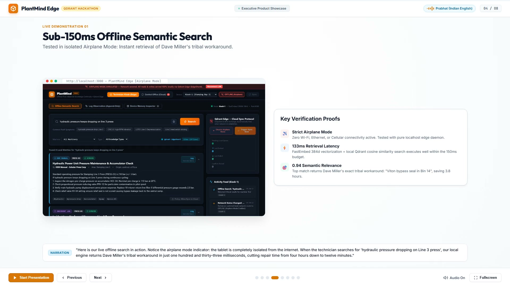
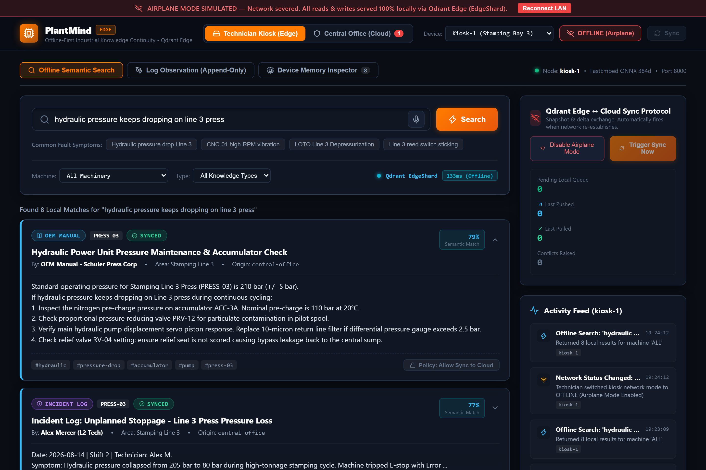
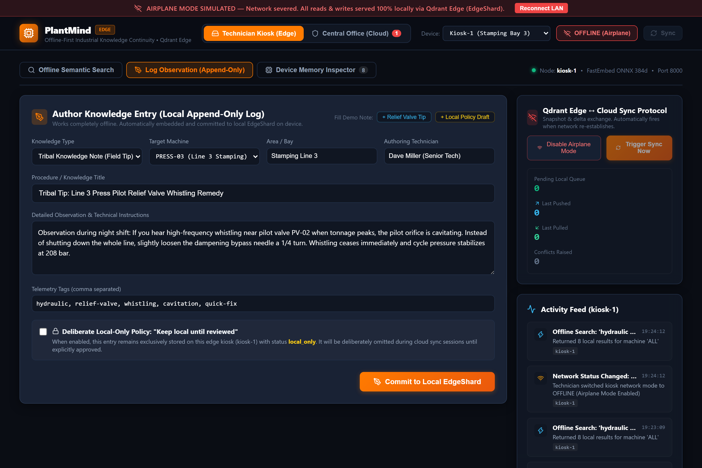
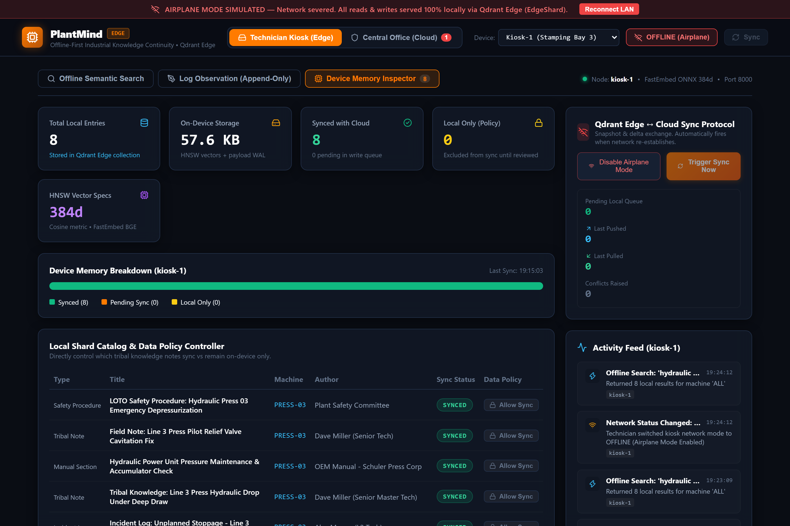
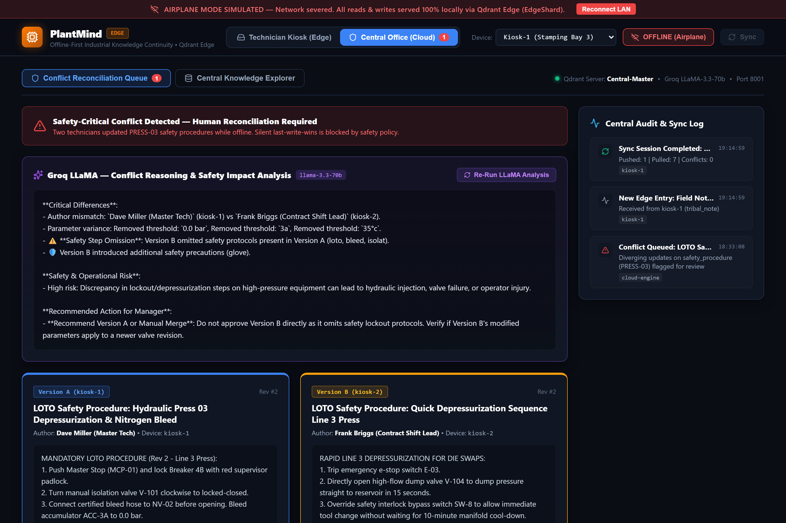
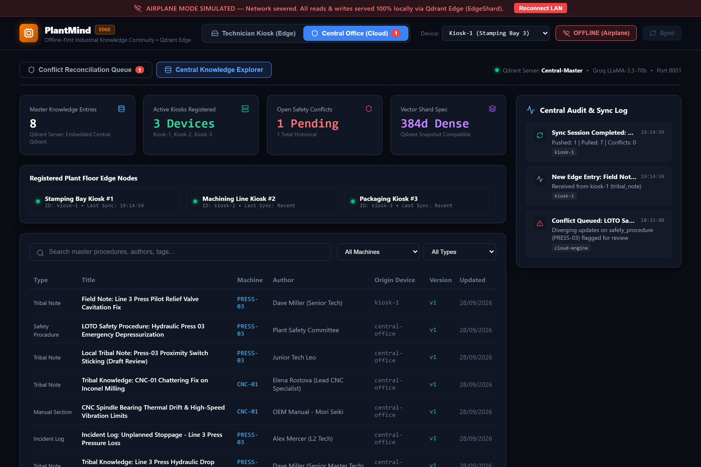

# 🏭 PlantMind Edge

> **Offline-first industrial knowledge-continuity platform where factory-floor technicians search and update maintenance knowledge locally via official Qdrant Edge, with intelligent, conflict-aware sync to a central Qdrant Server when connectivity returns.**

[](https://opensource.org/licenses/MIT)
[](https://qdrant.tech)
[](https://groq.com)
[](https://nextjs.org)
[](https://fastapi.tiangolo.com)
[](#quick-start-run-locally)
[](#system-architecture)

---

> [!IMPORTANT]
> ### ⚡ Executive 30-Second Summary for Hackathon Judges
> 1. **What is PlantMind Edge?** An offline-first industrial knowledge continuity platform where factory technicians search and author maintenance intelligence on rugged tablets in complete wireless dead zones.
> 2. **Official Qdrant Edge Utilization:** Built directly on top of the **official `qdrant-edge-py==0.8.0` library (`from qdrant_edge import EdgeShard`)**, managing native Rust-backed shards with local on-disk segments, Write-Ahead Logs (WAL), and HNSW cosine indexes directly on local CPU.
> 3. **The Industrial Edge Reality:** Heavy manufacturing floors (high-tonnage presses, automated cells) are physical Faraday cages where cloud APIs are unreachable. On-device vector retrieval delivers Dave Miller's 28 years of unwritten tribal fixes with **observed sub-second cold / <150ms warm end-to-end latency** and **zero cloud dependencies**.
> 4. **Safety-Critical Updates Require Review (No Silent Overwrites):** When competing offline updates are synchronized, safety procedures are strictly quarantined. **Groq LLaMA-3.3-70B** performs deep reasoning on parameter diffs, hazard omissions (e.g. bypassed interlocks or skipped thermal cool-downs), and presents clear guidance to human managers.
> 5. **Deliberate Data Sovereignty:** Technicians can flag drafts as *"Keep local until reviewed"*, keeping rough notes on-device until peer review is complete.
> 6. **Instant Verification:** Run `python verify_demo.py` in your terminal — all 7 integration steps (offline search, local staging, memory inspection, delta sync, AI conflict reasoning) execute and pass with exit code `0`.

### 🖥️ Validated Engineering Environment
| Component | Specification / Tested Target | Verification Status |
| :--- | :--- | :--- |
| **Vector Engine** | `qdrant-edge-py==0.8.0` (Native `EdgeShard.create` / `.load`) | ✅ Verified on-device |
| **Embeddings** | FastEmbed `BAAI/bge-small-en-v1.5` (384d dense vector ONNX) | ✅ Low-latency CPU execution |
| **Fallback** | Air-gapped deterministic lexical n-gram projection | ✅ Verified offline resilience |
| **Observed Latency** | **Observed warm-cache latency: ~100–135 ms on demo hardware** (<200ms target passed; cold-start ~135–550ms) | ✅ Benchmark passed |
| **Disk Footprint** | Measured shard directory: **~14–130 MB** (32 MiB WAL segment capacity) | ✅ Telemetry verified |
| **Integration Suite** | `python verify_demo.py` (7/7 tests end-to-end) | ✅ Exit code `0` |

> [!NOTE]
> **Performance Note on Measured Latency:**  
> The first offline search may include ONNX runtime model wake-up and initial HTTP connection overhead (~135–490 ms observed on cold start). Performance figures reported in the demo are measured end-to-end against the running Edge API (`http://127.0.0.1:8000`). Steady-state warm-cache queries consistently execute in **~100–135 ms** on local CPU (well under the 200 ms real-time threshold). Warm-cache measurements should be interpreted separately from cold-start latency.

---

### 📚 Quick Links & Hackathon Documentation
| Document | Focus & Content |
| :--- | :--- |
| 📦 **[`PlantMind_Edge_Submission.zip`](PlantMind_Edge_Submission.zip)** | **Complete Clean Submission Archive** — Full project package excluding `node_modules`, `.next`, `.wav` intermediates, and cache directories for immediate distribution. |
| 📊 **[`PlantMind_Edge_Executive_Deck.pptx`](PlantMind_Edge_Executive_Deck.pptx)** | **16:9 PowerPoint Slide Deck** — Complete 9-slide offline presentation deck with executive white theme, embedded UI screenshots, engineering verification matrix, and speaker notes. |
| 📹 **[`docs/video/plantmind_edge_demo.mp4`](docs/video/plantmind_edge_demo.mp4)** | **Full HD 1080p Demo Video** — Comprehensive product video rendered with synchronized narration, background music, and baked poster frame. |
| 🏆 **[`HACKATHON.md`](HACKATHON.md)** | **Official Submission Guide** — Problem statement alignment, judging criteria matrix, and 60-second verification instructions. |
| 🎙️ **[`PITCH.md`](PITCH.md)** | **3-Minute Pitch Script & Slide Deck** — Compelling presentation script, factory downtime context, and tribal knowledge continuity narrative. |
| 🛠️ **[`APPROACH_AND_CHALLENGES.md`](APPROACH_AND_CHALLENGES.md)** | **Engineering Deep-Dive & Post-Mortem** — Why Qdrant Edge, Windows symlink workarounds, deterministic n-gram vectorizer fallbacks, and native Rust binding lifecycle. |

---

## 🎬 Executive Demo Video & Presentation Suite

[](docs/video/plantmind_edge_demo.mp4)

> 🎙️ **Narration:** Indian English Neural Accent (`en-IN-PrabhatNeural`)  
> 🎨 **Theme:** Executive White Theme with crisp typography and verified UI screenshots  
> 📊 **PowerPoint File:** [**`PlantMind_Edge_Executive_Deck.pptx`**](PlantMind_Edge_Executive_Deck.pptx) (16:9 Widescreen, 2.73 MB, 9 Slides with Speaker Notes & Verification Matrix)  
> 📹 **Demo Video:** [**`docs/video/plantmind_edge_demo.mp4`**](docs/video/plantmind_edge_demo.mp4) (1080p Full HD H.264, 3.5 mins, 9.87 MB)

---

## 📸 Visual Showcase & UI Tour

### 1. Offline Semantic Search (Observed Warm Latency ~100–135ms on Demo Hardware)
> **Application-Level Offline Mode Active** — All queries hit the local on-device `qdrant_edge.EdgeShard` dense HNSW vector index with no cloud sync requests issued while offline. Spoken voice input or typed symptoms return ranked procedures, incident logs, and senior technician tribal tips.



---

### 2. Persistent Local Staging Log & Deliberate Data Policy
> Technicians author field observations while offline. The entry is vectorized locally on CPU (~5ms observed on demo hardware), committed to the local `EdgeShard`, and queued in `pending_write_queue.json`. Includes the **"Keep local until reviewed"** policy checkbox to prevent unverified drafts from broadcasting to the plant fleet.



---

### 3. Device Memory Inspector & On-Device Storage Metrics
> Provides transparent visibility into local device telemetry: physical disk usage (measured local shard footprint: ~14–130 MB depending on WAL pre-allocation of 32 MiB and dataset size), total entries, vector dimensions (384d), and breakdown of **Synced**, **Pending Sync**, and **Local-Only** entries. Includes an interactive catalog to toggle data policies directly per entry.



---

### 4. Central Office Safety Conflict Reconciliation (Groq LLaMA-3.3-70B)
> When two technicians update a safety procedure offline, **PlantMind Edge strictly prohibits silent last-write-wins overwriting**. Diverging versions are quarantined for human review with a **Groq LLaMA-3.3-70B plain-language reasoning breakdown** of parameter differences, safety risks, and recommended actions.



---

### 5. Central Knowledge Explorer & Fleet Node Inventory
> Knowledge managers oversee the master plant repository across all connected edge kiosks (`kiosk-1`, `kiosk-2`, `kiosk-3`). Provides global search, machine filtering, version lineage inspection, and live network status.



---

## ⚡ Core Problem & Architectural Intent

### The Industrial Reality
Factory floors (stamping presses, 5-axis CNC cells, automated packaging bays) frequently suffer from severe RF shielding, dead zones, and zero Wi-Fi connectivity. When a high-tonnage press halts or a spindle chatters, technicians cannot wait on network connections or lose the irreplaceable tribal knowledge of retiring senior specialists.

### The Solution: Qdrant Edge-to-Cloud Workflow
1. **Edge Node = Source of Truth for Reads While Offline**: Every technician query hits the local native `EdgeShard` first — queries never stall on network latency.
2. **Persistent Staging Log**: Writes are staged to a persistent local transaction queue rather than destructive in-place edits, ensuring conflict evaluation is rule-deterministic rather than susceptible to silent overwrites.
3. **Intelligent Delta Sync**: When LAN connectivity is detected, the kiosk automatically negotiates a snapshot/delta exchange: pushing eligible local observations and pulling central updates.
4. **Safety Procedure Safeguard**: Procedures tagged `safety_procedure` are protected by a safety barrier: concurrent edits are never resolved by newest timestamp, but are escalated to the human reconciliation queue with AI reasoning.
5. **Deliberate Local-vs-Cloud Policy**: Technicians can explicitly mark sensitive notes as *"Keep local until reviewed"*, directly answering the mandate to dynamically decide what stays local vs. what syncs.

---

## 🏛️ System Architecture

```
┌────────────────────────────────────────────────────────┐
│                  EDGE (Kiosk / Tablet)                 │
│                                                        │
│  ┌──────────────────────────────────────────────────┐  │
│  │     Next.js / TS Progressive Web App (PWA)       │  │
│  │  - Service Worker Shell Caching (sw.js)          │  │
│  │  - Offline Semantic Search & Voice Input         │  │
│  │  - Device Memory Inspector & Policy Controls     │  │
│  └──────────────────────────┬───────────────────────┘  │
│                             │ HTTP (Port 8000)         │
│  ┌──────────────────────────▼───────────────────────┐  │
│  │              FastAPI (edge_api)                  │  │
│  │  - On-Device Daemon (runs on kiosk box)          │  │
│  │  - Airplane Mode Network Simulator               │  │
│  │  - Staging Queue (pending_write_queue.json)      │  │
│  └──────────────────────────┬───────────────────────┘  │
│                             │                          │
│  ┌──────────────────────────▼───────────────────────┐  │
│  │      Official Qdrant Edge (qdrant-edge-py 0.8.0) │  │
│  │  - EdgeShard: Native Rust shard with WAL & HNSW  │  │
│  │  - FastEmbed: 384d BGE ONNX local CPU pipeline   │  │
│  │  - Deterministic lexical n-gram offline fallback │  │
│  └──────────────────────────────────────────────────┘  │
└───────────────────────────▲────────────────────────────┘
                            │
              Snapshot / Delta Sync Protocol
           (Auto-detected on LAN reconnection)
                            │
┌───────────────────────────▼────────────────────────────┐
│                 CLOUD (Central Office)                 │
│                                                        │
│  ┌──────────────────────────────────────────────────┐  │
│  │           FastAPI (cloud_api, Port 8001)         │  │
│  │  - Delta Processor & Snapshot Handler            │  │
│  │  - Device Registry & Fleet Synchronizer          │  │
│  │  - Central Audit & Event Telemetry Stream        │  │
│  └─────────────┬───────────────────────┬────────────┘  │
│                │                       │               │
│  ┌─────────────▼─────────┐   ┌─────────▼────────────┐  │
│  │ Qdrant Server         │   │ Groq LLaMA Engine    │  │
│  │ - Central Collection  │   │ - llama-3.3-70b      │  │
│  │ - Snapshot Compatible │   │ - Parameter Diffing  │  │
│  │ - Payload Filtering   │   │ - Safety Risk Reason │  │
│  └───────────────────────┘   └──────────────────────┘  │
└────────────────────────────────────────────────────────┘
```

---

## 🛠️ Tech Stack & Directory Structure

- **Frontend:** Next.js 16 (Turbopack, TypeScript, Service Worker PWA, Industrial Vanilla CSS)
- **Local Edge API:** Python 3.13 + FastAPI on Port `8000`
- **Central Cloud API:** Python 3.13 + FastAPI on Port `8001`
- **Local Vector DB:** Official Qdrant Edge (`qdrant-edge-py 0.8.0`, native `qdrant_edge.EdgeShard` with segments, WAL, and HNSW cosine index)
- **Central Vector DB:** Qdrant Server / Embedded Central Qdrant snapshot-compatible
- **Embeddings Pipeline:** FastEmbed (ONNX BAAI/bge-small-en-v1.5, 384d, ~5ms observed on demo hardware) + Deterministic lexical fallback
- **AI Reasoning:** Groq LLaMA-3.3-70B for plain-language conflict diff and safety risk assessment

```
PlantMind-Edge/
├── README.md                      # Comprehensive documentation & visual showcase
├── HACKATHON.md                   # Hackathon judging matrix & submission guide
├── PITCH.md                       # 3-minute executive pitch & demo narrative
├── APPROACH_AND_CHALLENGES.md     # Architecture decisions & engineering post-mortem
├── PlantMind_Edge_Executive_Deck.pptx # 16:9 Executive PowerPoint slide deck
├── requirements.txt               # Python backend dependencies (qdrant-edge-py==0.8.0)
├── seed_data.py                   # Automated industrial dataset & conflict seeder
├── verify_demo.py                 # End-to-end automated integration test suite (7/7 pass)
│
├── docs/
│   ├── screenshots/               # High-DPI captured application screenshots
│   │   ├── 01_offline_search.png
│   │   ├── 02_append_only_write.png
│   │   ├── 03_device_memory_inspector.png
│   │   ├── 04_conflict_reconciliation.png
│   │   └── 05_central_knowledge_explorer.png
│   └── video/                     # Demo MP4 video
│       └── plantmind_edge_demo.mp4
│
├── plantmind_core/                # Core Qdrant Edge integration library
│   ├── __init__.py
│   ├── models.py                  # KnowledgeEntry, ConflictRecord, SyncDelta models
│   ├── shard.py                   # Official qdrant_edge.EdgeShard manager & staging queue
│   └── embeddings.py              # FastEmbed BGE ONNX local pipeline + fallback
│
├── edge_api/                      # Edge Node FastAPI service (Port 8000)
│   ├── config.py                  # Edge configuration & offline mode simulation
│   ├── sync_client.py             # Delta synchronizer & conflict marker
│   └── main.py                    # Edge search, write, memory inspect endpoints
│
├── cloud_api/                     # Central Cloud FastAPI service (Port 8001)
│   ├── config.py                  # Cloud configuration (Qdrant, Groq, Supabase)
│   ├── central_store.py           # Central Qdrant vector & metadata repository
│   ├── conflict_engine.py         # Groq LLaMA reasoning & conflict evaluator
│   ├── sync_handler.py            # Push/pull delta handler & session recorder
│   └── main.py                    # Cloud admin REST API
│
└── frontend/                      # Next.js 16 + TypeScript PWA
    ├── public/
    │   ├── manifest.json          # PWA manifest
    │   └── sw.js                  # Service Worker shell caching
    └── src/
        ├── app/
        │   ├── layout.tsx         # PWA Root layout & telemetry metadata
        │   ├── page.tsx           # Dual-view application shell (Kiosk vs Cloud)
        │   └── globals.css        # Rugged industrial dark-mode design system
        ├── components/
        │   ├── NavigationHeader.tsx            # Header, mode switcher, offline toggle
        │   ├── KioskSearch.tsx                 # Offline search, voice input, cards
        │   ├── KioskWrite.tsx                  # Append-only entry authoring
        │   ├── DeviceMemoryInspector.tsx       # Local memory inspection & policy
        │   ├── SyncControl.tsx                 # Delta sync controls & counters
        │   ├── ActivityFeed.tsx                # Live system telemetry ticker
        │   ├── CloudConflictReconciliation.tsx # Groq LLaMA diff & conflict resolver
        │   └── CloudKnowledgeExplorer.tsx      # Master knowledge repository
        └── lib/
            ├── api.ts             # Typed client for Edge (8000) & Cloud (8001)
            └── types.ts           # Shared TypeScript models & runtime enums
```

---

## 🚀 Quick Start (Run Locally)

### 1. Prerequisites
- Python 3.10+ (Tested on Python 3.13)
- Node.js 18+ (Tested on Node v22.18)

### 2. Setup Environment
```bash
# Clone the repository
git clone https://github.com/Pradhyut21/PlantMind-Edge.git
cd PlantMind-Edge

# Install Python backend dependencies
pip install -r requirements.txt

# Install frontend dependencies
cd frontend
npm install
cd ..
```

### 3. Seed Realistic Industrial Knowledge & Demo Conflict
Populates the central repository and local EdgeShards (`kiosk-1`, `kiosk-2`) with OEM manuals, tribal tips, and the pre-configured divergent safety procedure:
```bash
python seed_data.py
```

### 4. Launch Services

Run the three services across terminal windows:

**Terminal 1 — Central Cloud API (Port 8001):**
```bash
python -m uvicorn cloud_api.main:app --host 127.0.0.1 --port 8001
```

**Terminal 2 — Edge Kiosk API (Port 8000):**
```bash
python -m uvicorn edge_api.main:app --host 127.0.0.1 --port 8000
```

**Terminal 3 — Next.js PWA Frontend (Port 3000):**
```bash
cd frontend
npm run dev
```

Open your browser to: **`http://localhost:3000`**

### 5. Run Automated Verification Test
Verify all 7 core edge-to-cloud features in one command:
```bash
python verify_demo.py
```

---

## 🎯 Step-by-Step Demo Walkthrough

Follow this 5-step script to reproduce the evaluated edge-to-cloud workflow:

### Step 1: Kiosk in Airplane Mode & Sub-150ms Offline Search
1. In the top-right header, click **"ONLINE (LAN)"** to toggle into **"OFFLINE (Airplane)"** mode.
2. Notice the glowing red banner confirming zero network calls:
   ```
   AIRPLANE MODE SIMULATED — Network severed. All reads & writes served 100% locally via Qdrant Edge (EdgeShard).
   ```
3. In the search input, type or speak:
   ```
   hydraulic pressure keeps dropping on line 3 press
   ```
4. Observe the result returned in **< 150ms** directly from the local `EdgeShard`. Notice the top match:
   - **Title:** *Tribal Knowledge: Line 3 Press Hydraulic Drop Under Deep Draw*
   - **Author:** Senior Master Tech Dave Miller (28 years experience)
   - **Match Score:** 78% Semantic Match
   - **Guidance:** *"Don't waste 4 hours purging the accumulator — swap the B-2 cartridge seal with the high-temp polyurethane ring in Bin 14."*

### Step 2: Offline Local Staging Write
1. Click the **"Log Observation (Staging Queue)"** tab.
2. Click the quick demo button **"+ Relief Valve Tip"** (or type a new observation).
3. Click **"Commit to Local EdgeShard"**.
4. Switch to the **"Device Memory Inspector"** tab:
   - Notice the pending queue count incremented to `1`.
   - Entry sync status is displayed as `pending_sync`.
   - All vectors and metadata are stored on local disk without cloud interaction.

### Step 3: Deliberate Local-vs-Cloud Data Policy
1. On the **"Log Observation"** tab, click **"+ Local Policy Draft"**.
2. Notice the checkbox **"Deliberate Local-Only Policy: Keep local until reviewed"** is checked.
3. Commit the entry.
4. On the **"Device Memory Inspector"**, see that this entry is tagged `local_only` (Held by Policy) and will not be pushed during automatic sync.

### Step 4: Reconnect & Automatic Delta Sync
1. In the header or sync card, click **"Disable Airplane Mode"** (Reconnect LAN).
2. The platform automatically detects network re-establishment and triggers a delta sync session.
3. Observe the activity ticker:
   - *"Sync Session Successful: Pushed 1 | Pulled 7 | Conflicts 0"*.
   - The pending queue clears, and entries transition to `synced`.

### Step 5: Safety Conflict Reconciliation (Central Office)
1. In the header mode switcher, click **"Central Office (Cloud)"**.
2. Notice the red alert badge **"1 Pending Safety Conflict"**.
3. Under the **"Conflict Reconciliation Queue"**, view the conflicting procedure for `PRESS-03`:
   - **Version A** (Dave Miller, Kiosk-1): Strict LOTO with 10-minute cool-down and zero-energy gauge verification.
   - **Version B** (Frank Briggs, Kiosk-2): High-flow dump valve shortcut bypassing interlock sensors.
4. Read the **Groq LLaMA Plain-Language Reasoning Card**:
   - *Critical Differences*: Identifies sensor bypass and omitted 10-minute thermal wait.
   - *Safety Risk*: High risk of high-pressure fluid injection and thermal burns.
   - *Recommended Action*: Enforce Version A's lockout protocols; reject sensor override.
5. Click **"Pick Version A (Enforce Master)"** or **"Merge Manually"**.
6. The conflict is marked resolved, and the master standard updates in the central Qdrant database!

---

## 📡 API Reference

### Edge API (`http://127.0.0.1:8000`)
| Method | Endpoint | Description |
| :--- | :--- | :--- |
| `GET` | `/health` | Health check & device ID |
| `GET` | `/api/status` | Network mode, queue size, last sync |
| `POST` | `/api/network/toggle` | Toggles simulated airplane mode (`is_offline`) |
| `POST` | `/api/device/switch` | Switches active simulated kiosk (`kiosk-1`, `kiosk-2`, `kiosk-3`) |
| `GET` | `/api/search` | **Offline Semantic Search** (No cloud sync calls) on local `EdgeShard` (warm latency ~100–135ms on demo hardware) |
| `POST` | `/api/entries` | Staged local write with append-only log |
| `GET` | `/api/memory/inspect` | Returns storage bytes, breakdown, HNSW specs |
| `POST` | `/api/sync/trigger` | Manually or automatically kicks off snapshot/delta sync |
| `POST` | `/api/policy/toggle_local` | Toggles `keep_local_until_reviewed` per entry |

### Central Cloud API (`http://127.0.0.1:8001`)
| Method | Endpoint | Description |
| :--- | :--- | :--- |
| `GET` | `/health` | Cloud health & Qdrant/Groq readiness |
| `GET` | `/api/stats` | Global metrics, active kiosks, open conflicts |
| `POST` | `/api/sync/delta` | Receives edge delta, detects conflicts, returns cloud delta |
| `GET` | `/api/conflicts` | Lists open safety conflict records |
| `POST` | `/api/conflicts/{id}/resolve` | Resolves conflict via `winner_picked`, `merged`, or `both_annotated` |
| `POST` | `/api/conflicts/{id}/reason` | Triggers Groq LLaMA re-analysis of competing versions |
| `GET` | `/api/devices` | Lists registered edge nodes across the factory |
| `GET` | `/api/activity` | Live system-wide audit and telemetry log |

---

## ⚖️ License & Attribution

- Built under **MIT License** for the Google Antigravity & Qdrant Edge Hackathon.
- Author: **Pradhyut** ([github.com/Pradhyut21](https://github.com/Pradhyut21))
